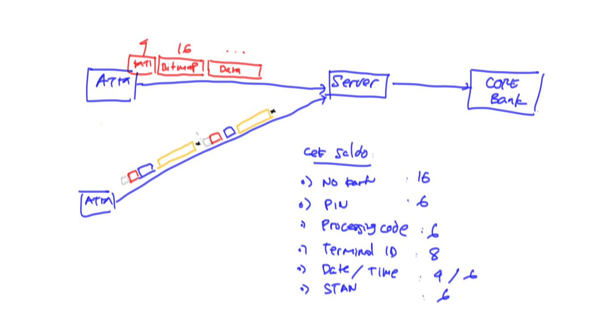

# Training ISO-8583 #



## Data Transaksi ##

Contoh data yang ingin dikirim:

2. No Kartu : 1234 5678 8765 4321
3. PC : 000010
7. DT : 1018095000
11. STAN : 000001
41. TID : ATM00010
52. PIN : 123456

## Perhitungan Bitmap ##

* Binary

```
01100010 00100000 : 16
00000000 00000000 : 32
00000000 10000000 : 48
00010000 00000000 : 64
```

* Bin : `0110001000100000000000000000000000000000100000000001000000000000`
* Hex : `6220000000801000`

## Pembuatan Message ##

* Data : 

```
12345678876543210000101018095000000001ATM00010123456
```

* MTI :`0200`

* Request :

```
0200622000000080100012345678876543210000101018095000000001ATM00010123456
```

## Variable Length Data

* Contoh data : `Endy`
* Tipe data LLVAR : `04Endy`
* Tipe data LLLVAR : `004Endy`

## Message Separator ##

* Length Prefix : 0100 -> for
* Trailer : -1 -> while

## Contoh Message dengan Trailer ##

```
0200622000000080100012345678876543210000101018095000000001ATM00010123456x0200622000000080100012345678876544440000101018095000000001ATM00023123456
```

## Contoh Message dengan Length Prefix ##

```
00720200622000000080100012345678876543210000101018095000000001ATM00010123456
```

## Perhitungan Network Byte Order ##

Beberapa switching meminta message length dikirim dengan 2 byte network byte order. Maksudnya adalah 2 byte tersebut dikirim secara `big-endian`. Lebih detail mengenai `big-endian` bisa dibaca [di Wikipedia](https://en.wikipedia.org/wiki/Endianness) dan cara membuatnya bisa dibaca di [StackOverflow](https://stackoverflow.com/a/1992054/855470).

Misalnya, kita punya string sebagai berikut:

```java
String message = "Hello World";
```

Maka kita bisa membuat message length dengan network byte order sebagai berikut:

```java
byte[] nbo = new byte[2];
byte[0] = (byte) ((message.length() >> 8) & 0xff);
byte[1] = (byte) (message.length() & 0xff);
```

Atau bisa juga langsung kita kirim dengan `DataOutputStream.writeShort(message.length());`

## Run Web Interface ##

1. Pindah ke folder project

        cd web-jpos-client

2. Jalankan aplikasi

        gradle bootRun

3. Request dengan method `POST` ke `http://localhost:8080/topup` dengan body content berikut

    ```json
    { 
      "msisdn" : "081234567890123", 
      "nilai" : 50000 
    }
    ```

    Bila dijalankan dengan `curl` perintahnya sebagai berikut:

        curl -d '{ "msisdn" : "08123456787654321", "nilai" : 50000 }' -H 'Content-Type: application/json' http://localhost:8080/topup

4. Cek log di server dan response dari http request

## Post Test ##

Silahkan isi test hasil training [di sini](https://goo.gl/forms/FjFE917ZI3IEWae62) :)
